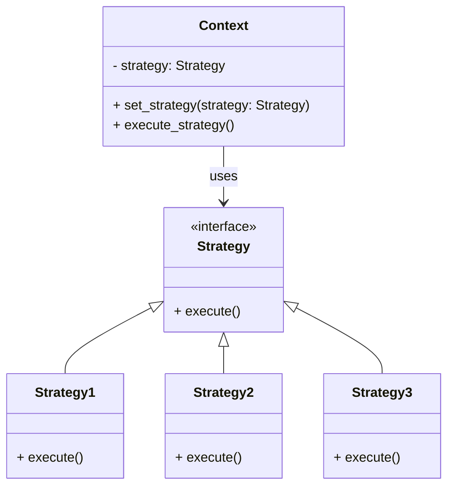

# Strategy Design Pattern (Python)

This example demonstrates the **Strategy Design Pattern** in Python. The Strategy pattern enables selecting an algorithm's behavior at runtime. It defines a family of algorithms, encapsulates each one, and makes them interchangeable.

## Structure

- **Context**: Maintains a reference to a Strategy object and can switch strategies at runtime.
- **Strategy (Interface/Abstract Class)**: Declares a method that all concrete strategies must implement.
- **Concrete Strategies**: Implement the algorithm using the Strategy interface.

## UML Diagram



## Files

- `context.py`: Contains the `Context` class that uses a `Strategy`.
- `strategy.py`: Defines the `Strategy` interface.
- `strategy1.py`, `strategy2.py`, `strategy3.py`: Implement different strategies.
- `main.py`: Demonstrates usage of the pattern.

## Example Usage

```python
from context import Context
from strategy1 import Strategy1
from strategy2 import Strategy2
from strategy3 import Strategy3

context = Context(Strategy1())
context.execute_strategy()  # Uses Strategy1

context.set_strategy(Strategy2())
context.execute_strategy()  # Uses Strategy2

context.set_strategy(Strategy3())
context.execute_strategy()  # Uses Strategy3
```

## When to Use
- When you have multiple related algorithms for a specific task and want to switch between them at runtime.
- To avoid using many conditional statements for selecting behaviors.
- To encapsulate algorithm implementation details and make them interchangeable.


---


## Explore More

- [Back to Behavioural Design Patterns](../README.md)

---

## Explore Other Design Pattern Categories

- [Creational Design Patterns](../../Creational-Design-patterns/README.md)

*Author: [ Nikhil Yadav ]*
