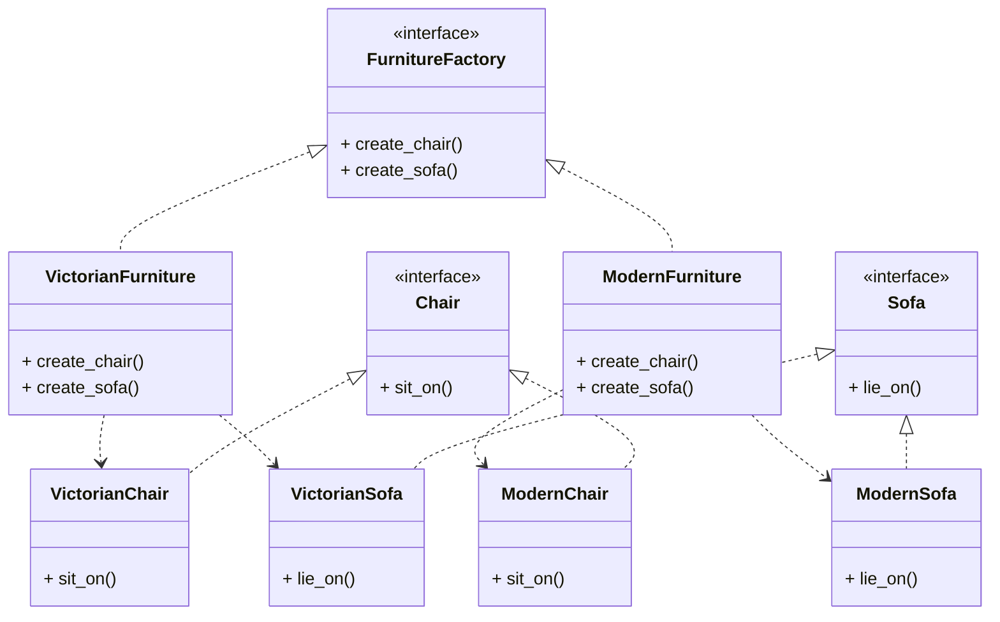

# Abstract Factory Design Pattern (Python)

The **Abstract Factory Design Pattern** provides an interface for creating families of related or dependent objects without specifying their concrete classes. It is useful when your code needs to work with various families of related products, but you don't want it to depend on the concrete classes of those products.

---

## Definition

Abstract Factory defines an interface for creating all distinct products but leaves the actual product creation to concrete factory subclasses. Each factory type corresponds to a certain product family.

---

## UML Diagram

---

## Files

- `abstract_factory.py`: Abstract factory interface.
- `concrete_factories.py`: Concrete factory classes for each product family.
- `concrete_product.py`: Concrete product implementations (chairs, sofas).
- `product_interface.py`: Product interfaces (Chair, Sofa).
- `main.py`: Demonstrates usage of the pattern.

---

## Example Use Cases

- UI toolkits that support multiple themes (e.g., Windows, Mac, Linux widgets)
- Creating families of related products (e.g., Victorian vs. Modern furniture)
- Ensuring products from the same family are used together

---

## Explore More

- [Back to Creational Design Patterns](../README.md)
- [Behavioural Design Patterns](../../Behavioural-Design-patterns/README.md)

*Author: [Nikhil Yadav]*
