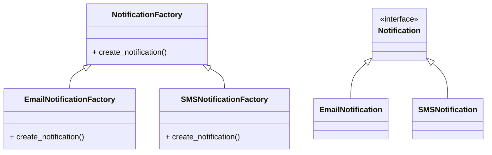

# Factory Method Pattern (Python)

The **Factory Method Pattern** defines an interface for creating an object, but lets subclasses decide which class to instantiate. This pattern lets a class defer instantiation to subclasses.

---

## Definition
A factory method is a method that returns objects of a common supertype, but allows subclasses to alter the type of objects that will be created.

---

## UML Diagram

---

## Files
- `factory.py`: Factory interface/class.
- `email_notification_factory.py`, `sms_notification_factory.py`: Concrete factories.
- `notification.py`: Notification interface.
- `email_notification.py`, `sms_notification.py`: Concrete notification classes.
- `main.py`: Example usage.

---

## Example Use Cases
- Frameworks and libraries that need to allow users to extend and customize object creation
- Decoupling code from specific classes

---

## Explore More
- [Back to Factory Design Patterns](../README.md)
- [Simple Factory Pattern](../simple-factory/README.md)

*Author: [Nikhil Yadav]*
