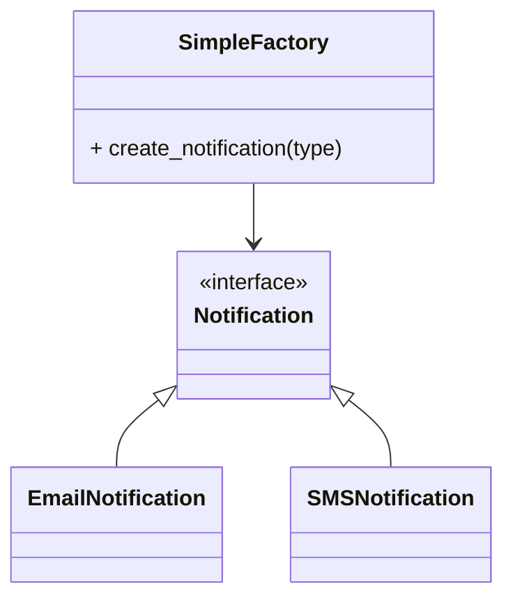

# Simple Factory Pattern (Python)

The **Simple Factory Pattern** centralizes object creation logic in a single factory class. The client requests an object by specifying a type, and the factory returns the appropriate instance. This pattern is not a true GoF design pattern but is widely used for its simplicity.

---

## Definition
A simple factory provides a static method to create and return objects of different types based on input parameters.

---

## UML Diagram

---

## Files
- `simple_factory.py`: The factory class.
- `notification.py`: Notification interface.
- `email_notification.py`, `sms_notification.py`: Concrete notification classes.
- `main.py`: Example usage.

---

## Example Use Cases
- Centralizing object creation logic
- Decoupling client code from concrete classes

---

## Explore More
- [Back to Factory Design Patterns](../README.md)
- [Factory Method Pattern](../factory-method/README.md)

*Author: [Nikhil Yadav]*
