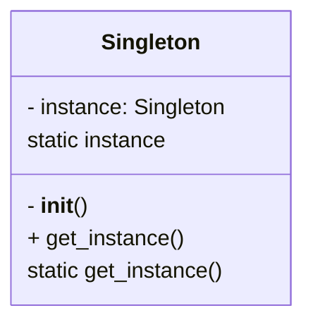

# Singleton Design Pattern (Python)

The **Singleton Design Pattern** ensures that a class has only one instance and provides a global point of access to it. This is useful when exactly one object is needed to coordinate actions across the system.

---

## Definition

Singleton restricts the instantiation of a class to a single object. This is useful for shared resources like configuration, logging, or connection pools.

---

## UML Diagram

---

## Files

- `simple_singelton.py`: Basic singleton implementation.
- `eager_singelton.py`: Eager initialization singleton.
- `thread_safe_singelton.py`: Thread-safe singleton implementation.
- `main.py`: Demonstrates usage of the singleton pattern.

---

## Example Use Cases

- Database connection pool
- Logger
- Configuration manager

---

## Explore More

- [Back to Creational Design Patterns](../README.md)
- [Behavioural Design Patterns](../../Behavioural-Design-patterns/README.md)

*Author: [Nikhil Yadav]*
